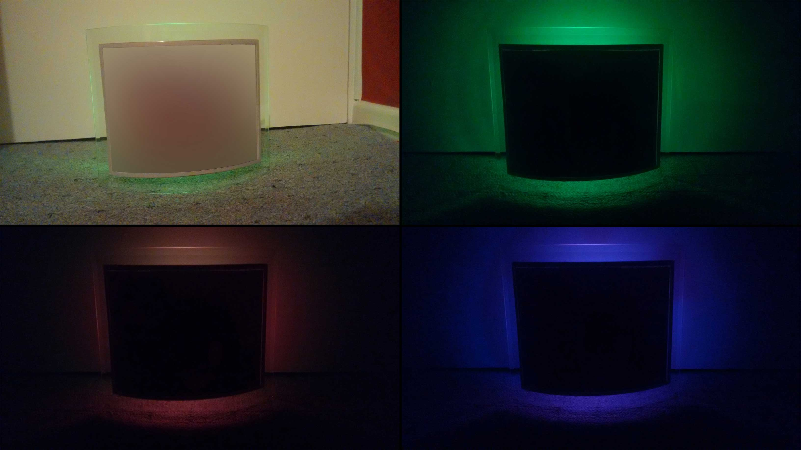
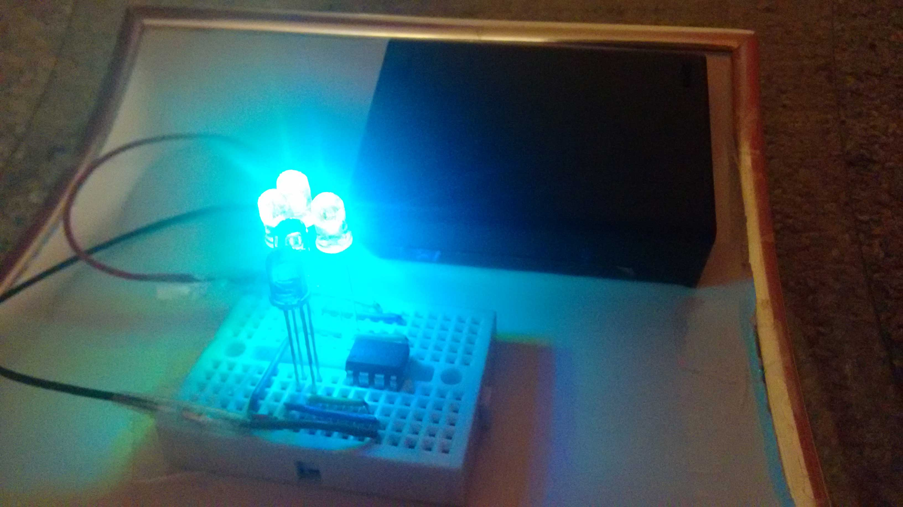
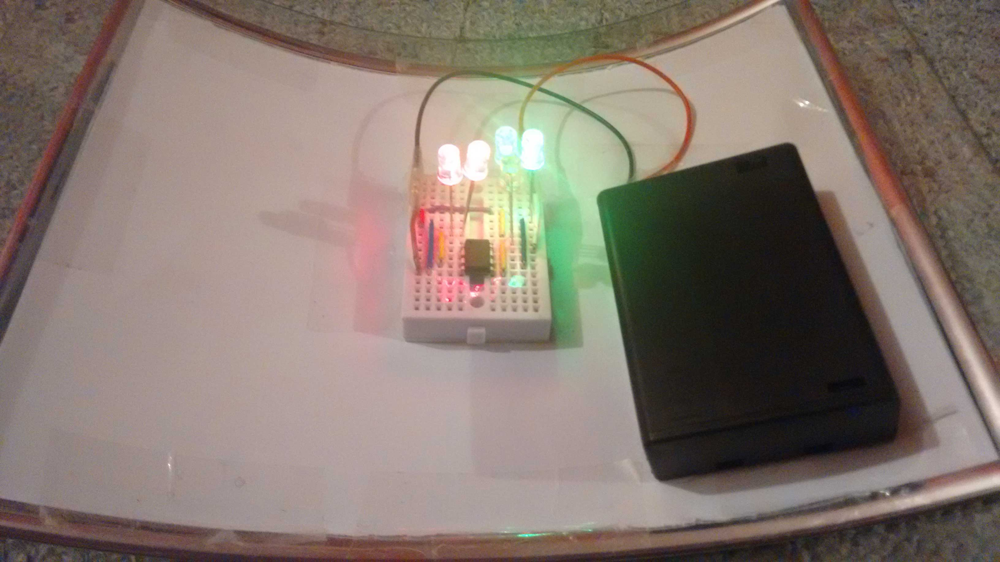

I wanted to make a photo frame gift more interesting, so added an ambient lighting effect by attaching a
small circuit to the back of the frame. Initially powered by an Arduino Uno, the C++ code controlling the timing of the
RGB LEDs was recompiled for an ATtiny45 microcontroller (enabling AA battery power) to significantly reduced the
project’s physical size, cost, and power consumption. The red, green, and blue LEDs can produce a smooth transition
across most of the visible light spectrum with vibrant intensity which refracts nicely to illuminate the glass frame and
backdrop.

  


