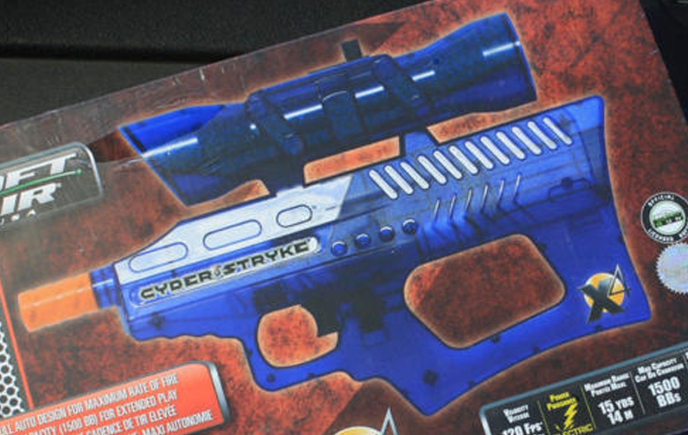
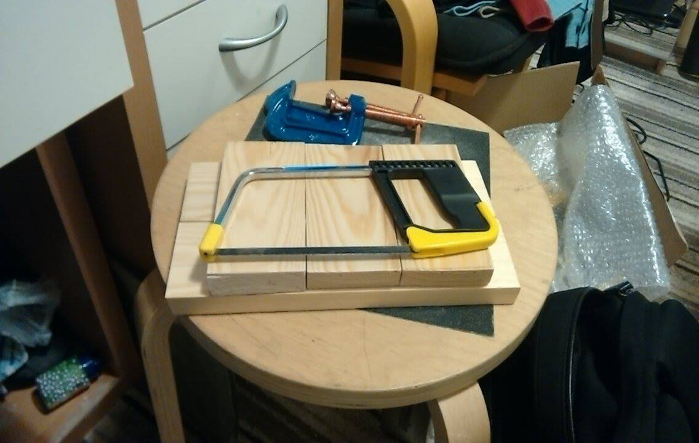
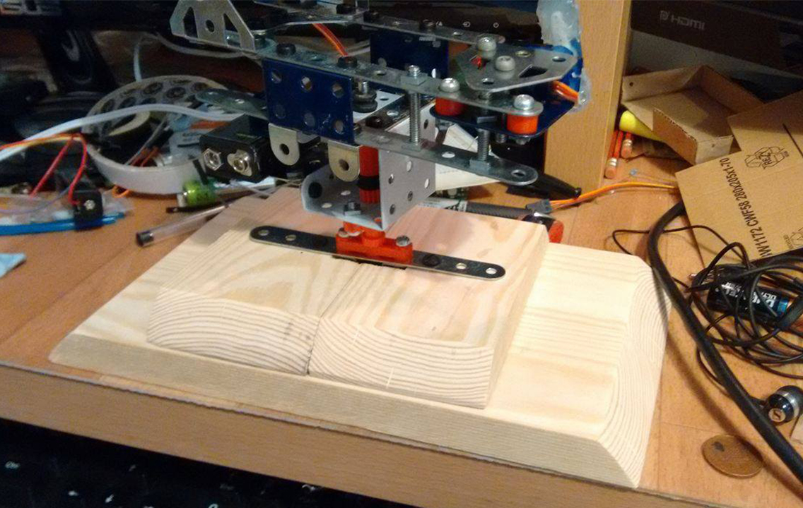
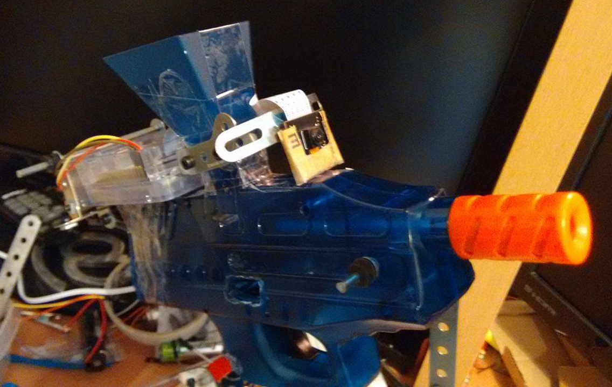
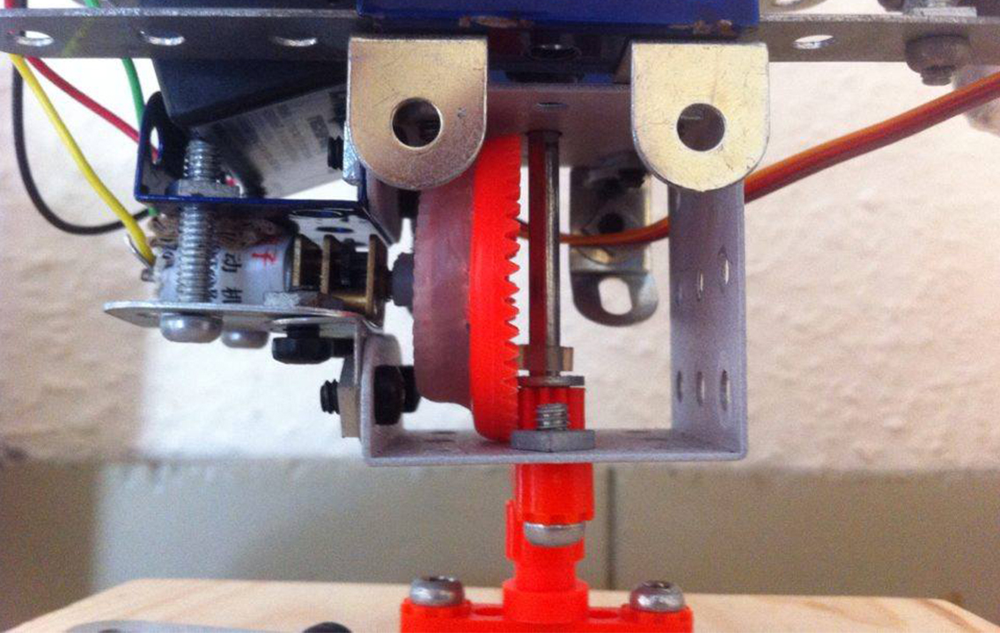
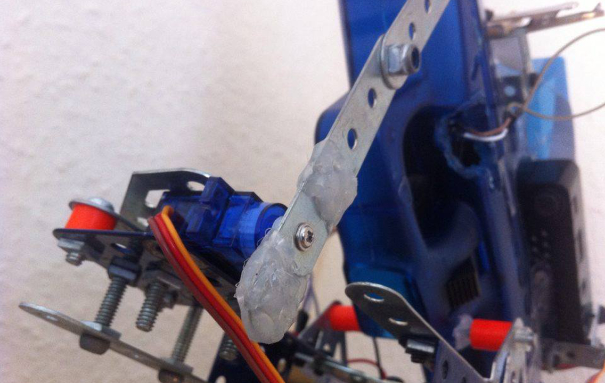
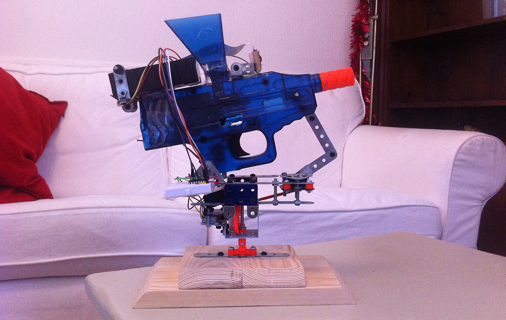
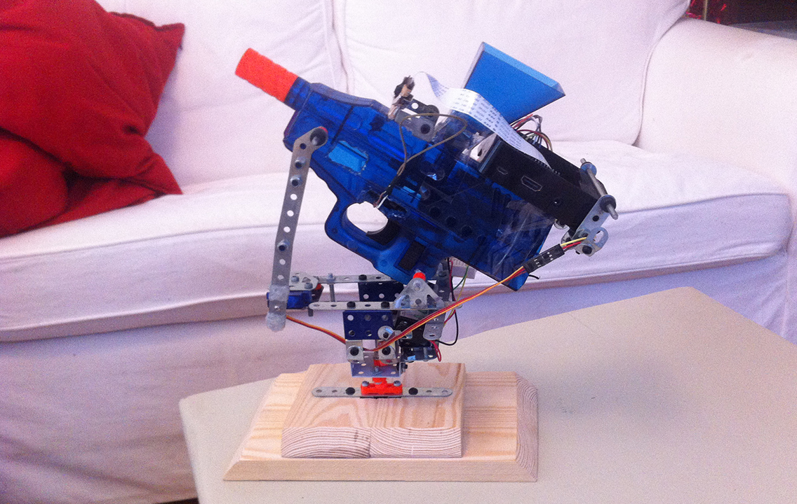

See the GitHub repository [here](https://github.com/jemgunay/bagel-turret).

My flat mates and I were fooling around with some cheap BB guns and an fun idea dawned on me: to build an automatic
surveillance turret! I wanted to develop a web interface for controlling the aiming and firing of the turret and could
then apply computer vision technologies to detect and aim for specific targets to test the accuracy of the gun.

I dug out my old childhood [Meccano](http://www.meccano.com) set which would be used to construct a frame to mount the
gun and electronics onto. I searched online for a cheap electric BB gun that would be easy to modify; I went with the
automatic CYBER STRYKE X4 BB gun as it was cheap and had a semi-transparent housing, meaning I would be able to locate
the electronics and firing mechanisms with ease. Having experimented with [OpenCV](http://opencv.org) on my old original
Raspberry Pi, I soon realised that if I wanted to stream the turret’s view to a web interface in real time with minimum
lag, as well as perform object classification/detection, I would have to invest in a Raspberry Pi 3 which has
significantly more processing power. I already had a NOIR Pi Camera which I will use for now to stream the turret's
view - I may get a standard Pi Camera when I reach the computer vision implementation phase as the colourisation from
the IR light may impact upon accuracy.

  

A cheap hobby motor was used to control the horizontal rotation and a servo was used to control the vertical aiming. I
hacked together a couple of gears to reduce the load on the motor and glue-gunned a retractable arm to the servo and
attached the other end to the gun, allowing the arm to extend and retract when the servo changes orientation. The servo
was wired directly to the Pi's 5V output, though the motor required more power; by using an L293D Motor Driver IC, I was
able to supply power via a 9V battery to the motor whilst providing easier control over the motor's direction of
rotation. Short python classes were then written to interface with the motor and servo, making it easier for me to test
how well they functioned under the weight of the gun. The servo struggled to sustain the weight of the gun so I trimmed
off the extra aesthetic plastic housing and removed the battery storage section towards the back – this can be
repositioned elsewhere on the turret frame reducing the load on the servo. Despite these modifications, sharp movements
caused the unstable Meccano base to wobble; I decided to build a new bottom base out of wood to structure the rest of
the Meccano frame onto.

  

A further python script was then programmed to create a simple demo to show off the horizontal and vertical aiming
capabilities - this can be seen in action below. The Python scripts for this project can be found on GitHub below.

 



[Click here to read part 2!](/p/bagel-turret-remote-surveillance-turret-part-2)