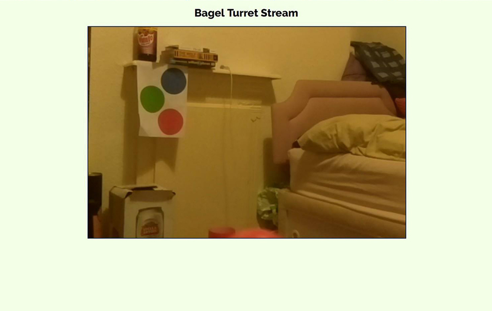
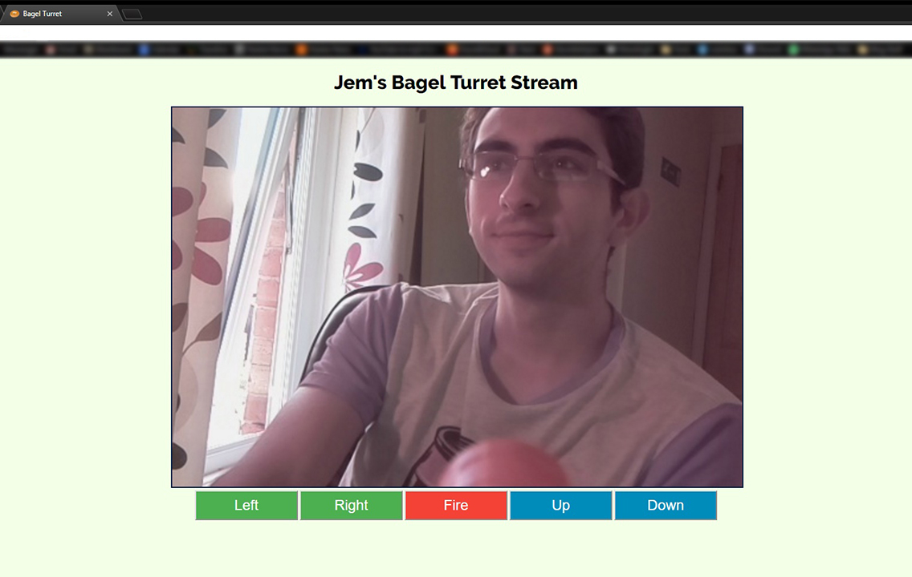
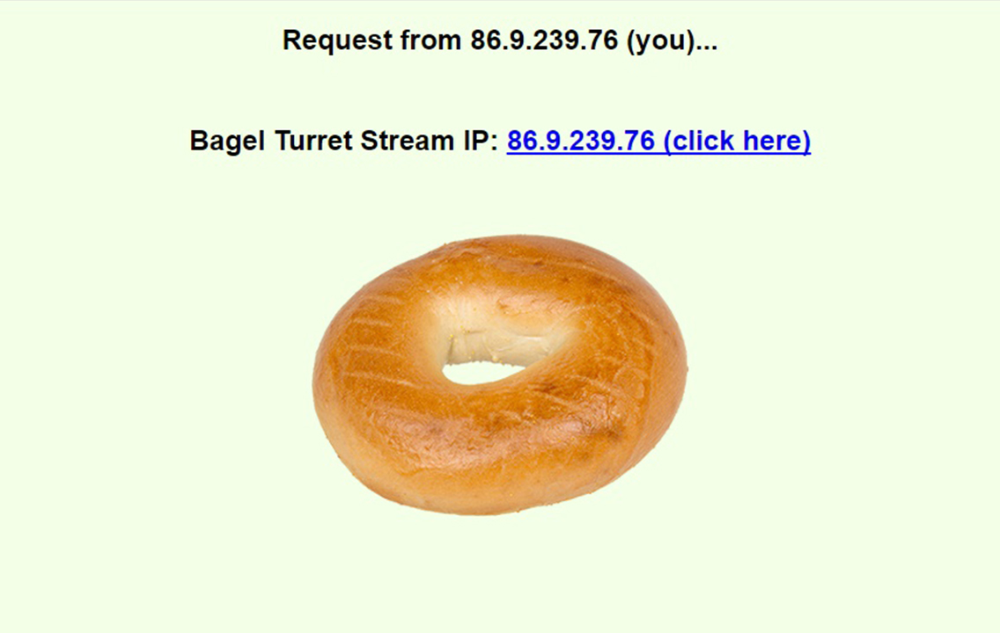

Now that the framework for the turret movement was sorted, I moved onto the video streaming functionality. This was
implemented by creating a web application using the Flask framework to serve the video stream one frame at a time to the
user’s browser by reading an image from the Pi Camera and encoding it with appropriate headers before sending it as a
response. When a user clicks a command button, a request is received by the server, and the desired action is carried
out by the hardware manipulating Python classes such as stepping the servo to aim vertically, applying power to the
motor to turn the turret horizontally or firing the gun. Basic access authentication is forced so that only users who
have been provided with the username/password combination can access the turret’s stream.

In order to make connecting to the Raspberry Pi Flask server more straightforward, the Python script also sends a
request to my external testing server which hosts a PHP script; this script logs the public IP address of the Pi and
displays it to the user, allowing them to be able to access the turret’s stream (assuming the Pi is connected to a
router which has its private IP port forwarded). Last but not least, the Bagel Turret wouldn’t be a Bagel Turret without
a few bagels – the favicon is a tiny bagel and the web page for displaying the Raspberry Pi’s public IP address features
a full size bagel just in case someone is uncertain about the purpose of the page.

  

[GitHub project repository](https://github.com/jemgunay/bagel-turret)

[Click here to read part 1!](/p/bagel-turret-remote-surveillance-turret-part-1)