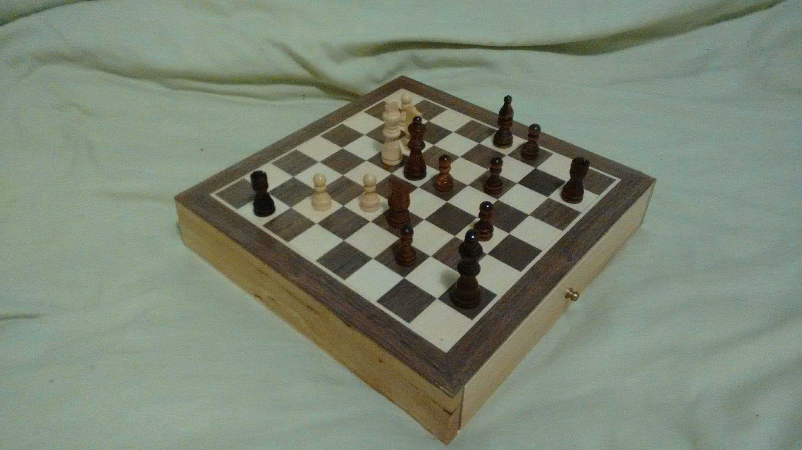
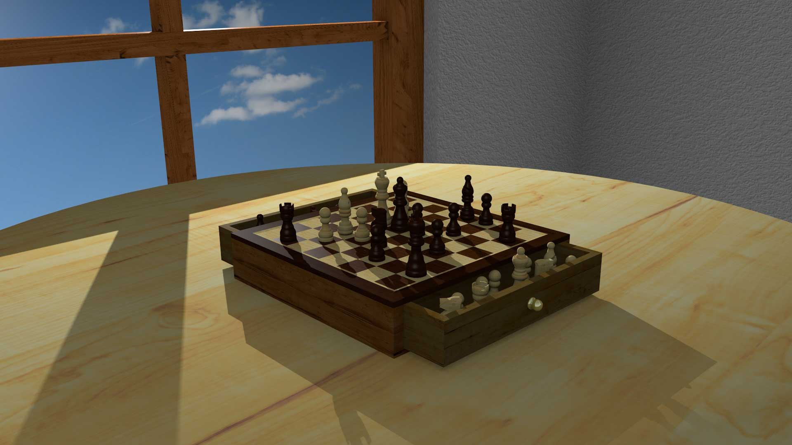
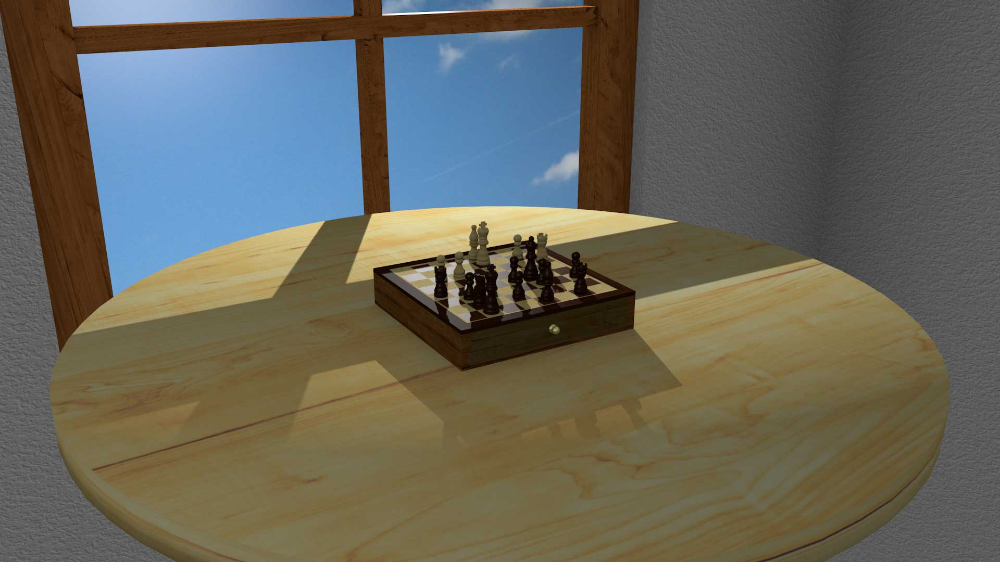
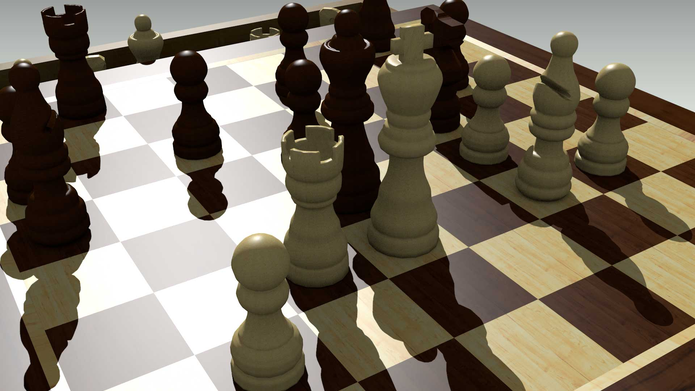
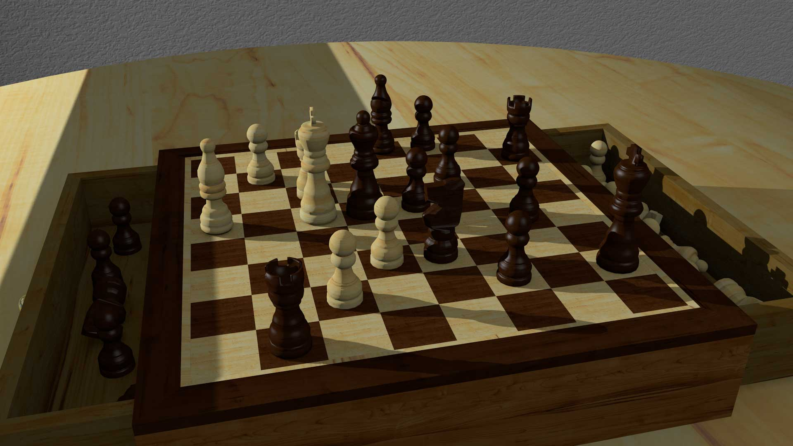
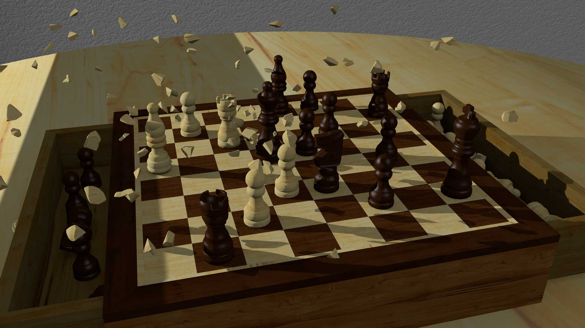
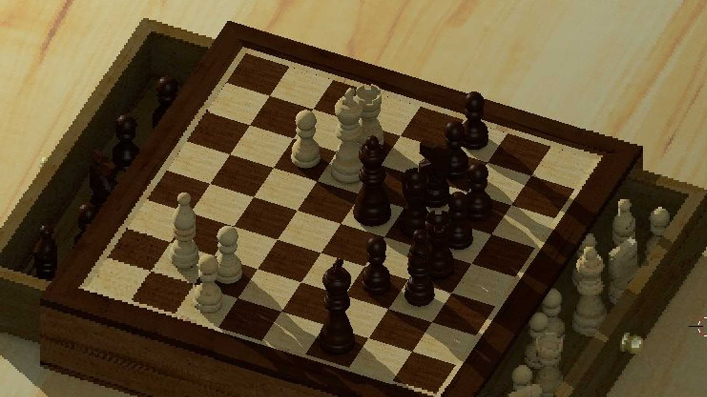
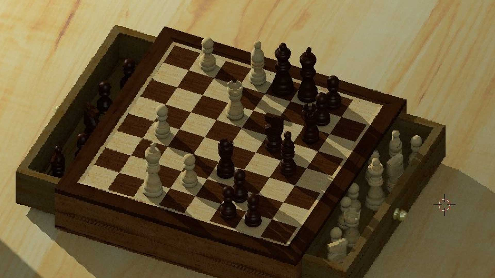
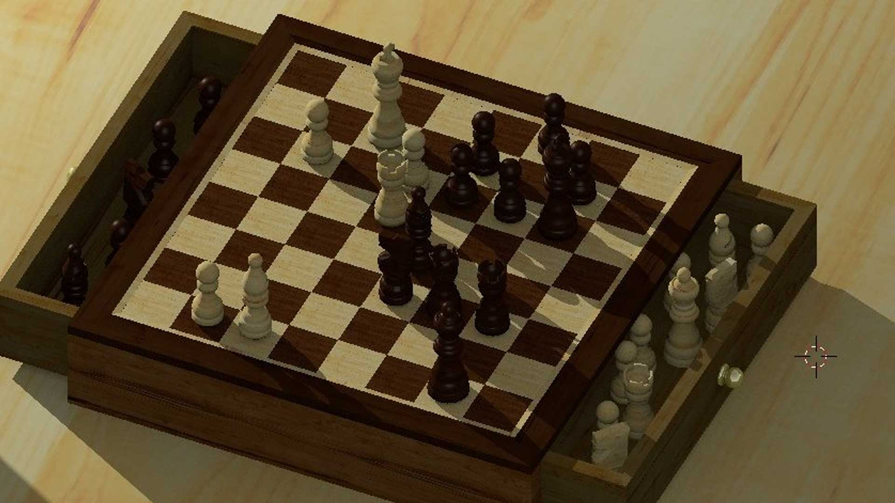

I took a module at university focussing on 3D modelling techniques which gave me the opportunity to create a realistic
and substantial model of a photographed object. I had to create an animation including the model and had to produce a
Python script which manipulated the scene in some way. I settled on modelling my chess board/pieces, sculpting them to
scale and texturing them realistically.

  

  

I animated the camera panning in towards the chess board as the piece storage draws open; a game is played by invisible
players, taking turns one move at a time. Once a king is in check mate, he explodes out of shame, scattering shards of
himself across the scene. This was achieved using Blender's Cell Fracture add-on.



The Python script randomises the positions and orientations of all chess pieces on their side of the board, creating a
new game scenario. However, the script does not respect the rules of chess, meaning unrealistic and impossible game
scenarios can be generated. Within Blender, the user can move a chess piece from one of the storage trays above the
board and execute the script; this causes the piece to be included in the new randomised game scene. When a piece is
moved below the top of the board, it is excluded from the game scene.

  