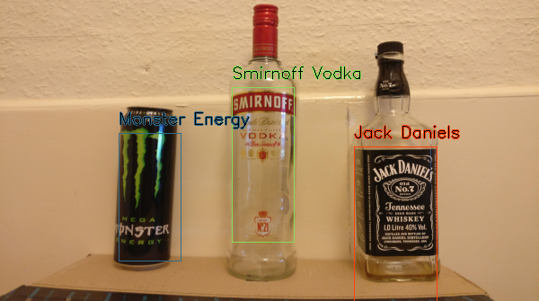
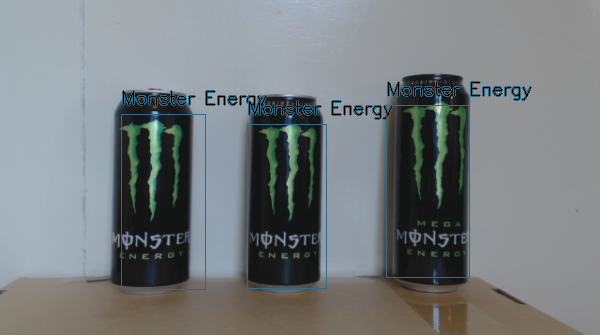
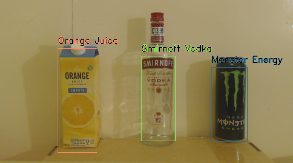
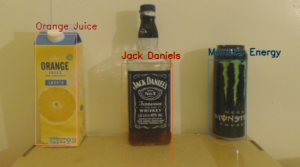
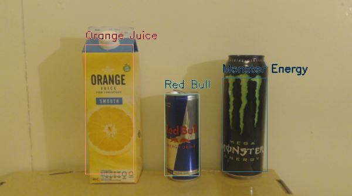
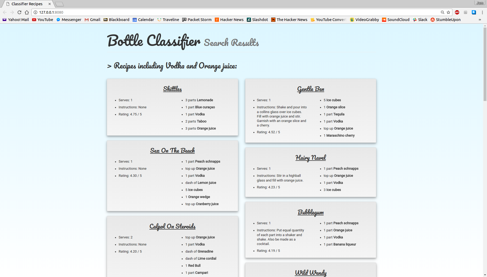
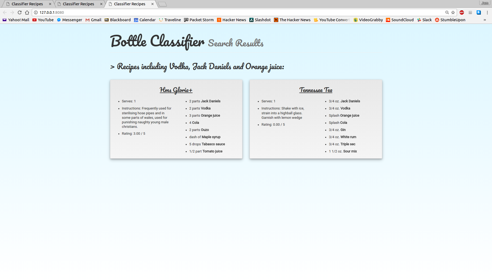

See the GitHub repository [here](https://github.com/jemgunay/bottle-classifier).

For my university third year dissertation project, I developed a computer vision-orientated application for detecting
and classifying bottles from a camera stream or image frame, as well as displaying appropriate cocktail recipes based on
the classified bottles in an aesthetically pleasing web page.

This was achieved using trained **HAAR/LBP** cascades (using the [OpenCV](https://opencv.org/) implementations) for
detection and colour histograms generated from detected regions of interest to improve classification performance. The
applications were written primarily in Python utilising a wide number of libraries (list can be seen on GitHub
repository), though web languages were also used for rendering the resolved recipes. The tool currently classifies
*Smirnoff Vodka* and *Jack Daniel's* bottles, as well as *Red Bull* cans, *Monster Energy* cans and an *orange juice
carton*. MySQL was used to store the scraped cocktail recipes.

Several command line tools were developed which allow the flexible execution and maintenance of the tool:

- **Recipe Scraper**: used to scrape a recipe by name or multiple recipes by ingredient name from a cocktail recipe
  website into the database.
- **Histogram Generator**: used to generate specially formatted histogram files which represent the colour spectrum of
  the target image.
- **Main Application**: used to perform classification of the target image frame or camera stream. Also used to resolve
  the cocktail recipes and to launch the web server for hosting the recipe view render.

Screenshots of the classification of bottles from a live webcam feed:

  
 

Screenshots of the cocktail recipe lists resolved from classified bottles:

 