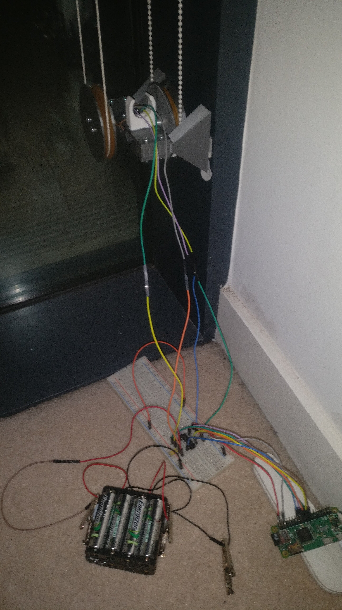
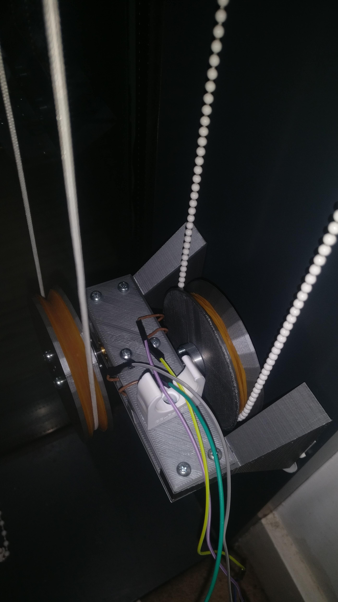

See the GitHub repository [here](https://github.com/jemgunay/echo-blinds).

I created an Amazon Alexa skill server in Golang for controlling window blinds. It works by receiving instructions from
Alexa utterances via AWS, which in turn trigger motors controlled via a Raspberry Pi Zero's GPIO pins. These motors then
pull the window blinds cords to rotate and pull them open. The motors and blinds cords were mounted to a 3D printed
chassis, of which the models were precisely designed in Blender.

 

