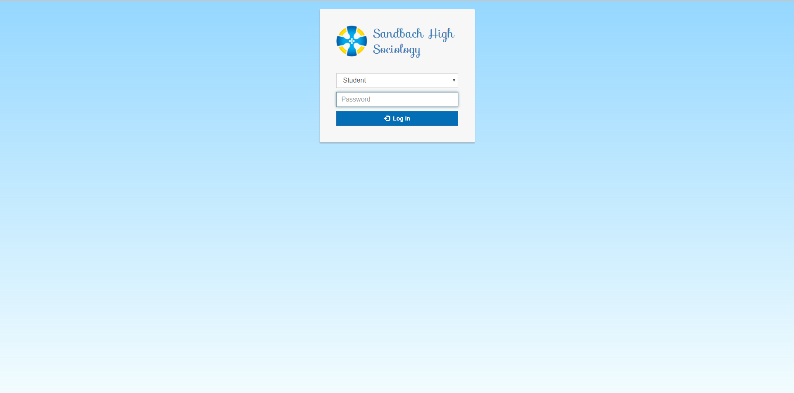
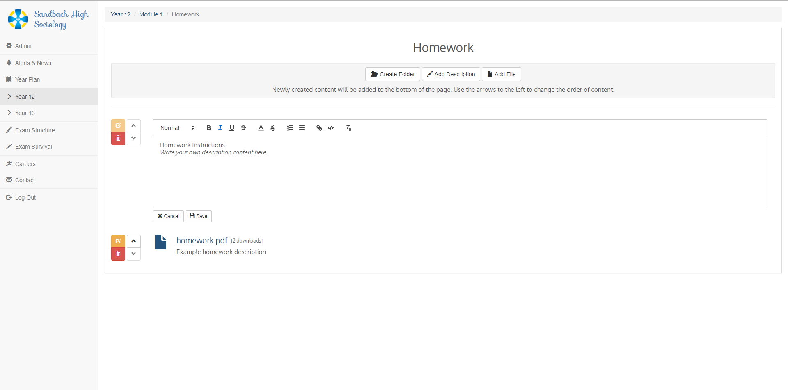
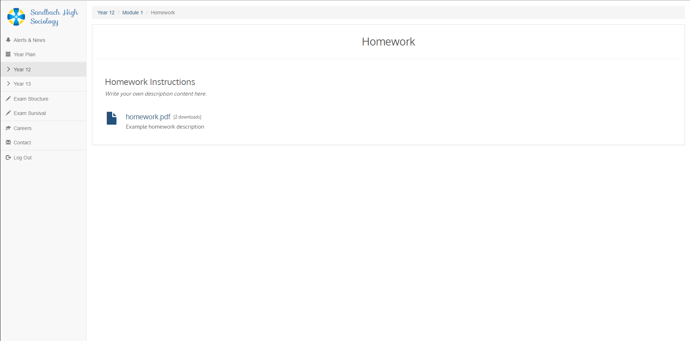
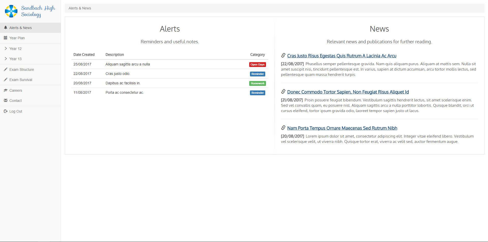
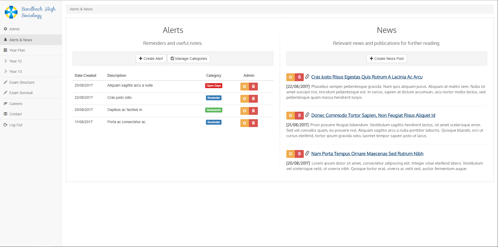
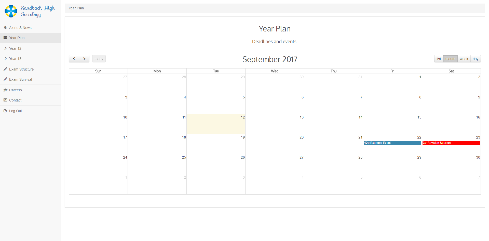
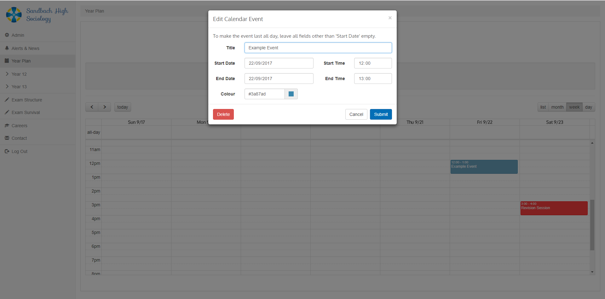
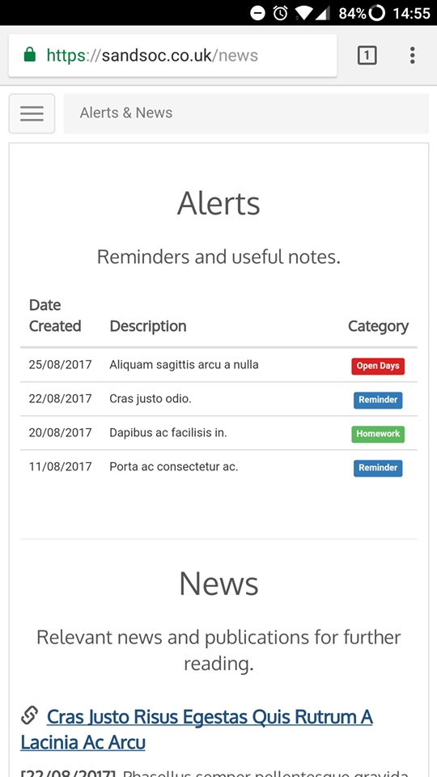
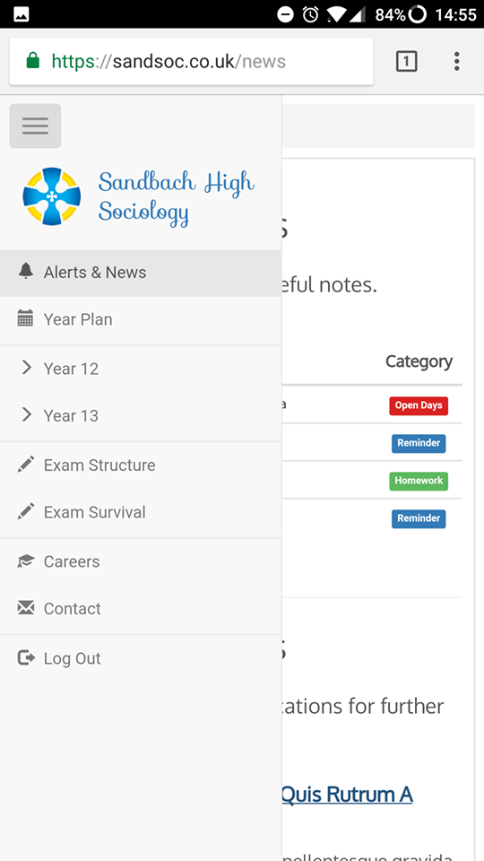
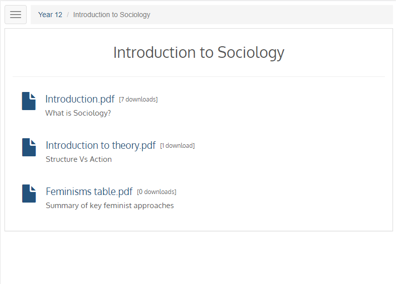

See the GitHub repository [here](https://github.com/jemgunay/liteboard).

**liteboard** is a flexible, lightweight and open-source course management system developed for courses and schools which
do not have access to alternative paid learning tools such as Blackboard or Moodle. The high school sixth form where my
mum teaches at is an example of such a school, whose resources are limited to a local network shared documents system
which offers little structure or clarity; in addition, students cannot access this system from home. 'liteboard'
overcomes these limitations and is currently being successfully trialled by the school's sociology department.

The following features are supported:

- Categorised homepage alerts and news article posts for extended reading.
- Year plan/calendar with multiple views (year/month/week/day).
- Customisable nested folder functionality for organising uploaded files and written descriptions (including description
  formatting tools).
- Login portal for 'Student' and 'Teacher' accounts; the latter offers administrator controls for creating and modifying
  content.
- Account log in and download counters to provide a rough estimate of how many students are using the system.
- Slick and responsive user interface design - information is displayed very cleanly on mobile (see below).

This comprehensive feature set allows teachers to organise their files and other course content in an organised fashion,
facilitates the presentation of important dates and notes for students and fellow teachers and can be accessed any the
majority of desktop, tablet and mobile devices at school or from home; for example, this is useful for students who have
missed lessons due to illness, providing them with the means to catch up with missed lessons from home.

The project was developed in PHP with the [Fat-Free Framework (F3)](https://fatfreeframework.com) for the back end. HTML, CSS (with Bootstrap) and
Javascript/jQuery were used for the front end functionality. The application files can be found on GitHub (link at the
bottom) where installation instructions are provided.

Screenshots on desktop:

  
 

  

Screenshots demonstrating the responsive design on mobile:

 
