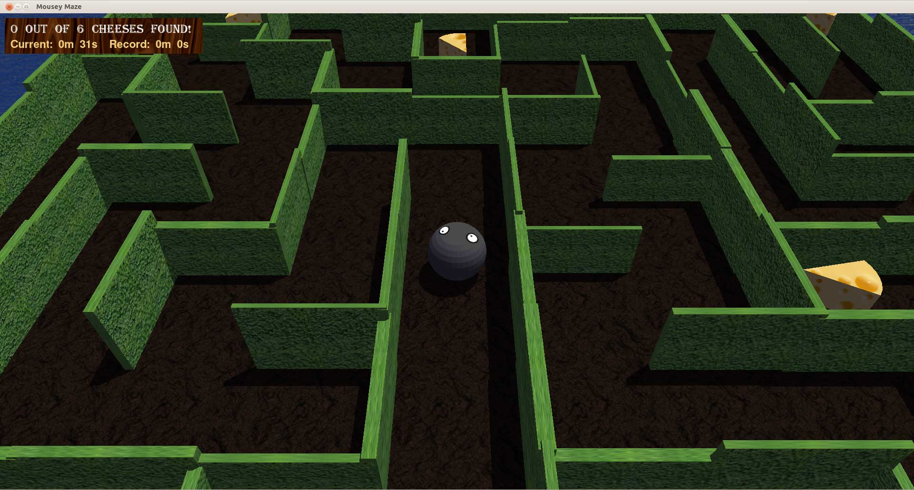
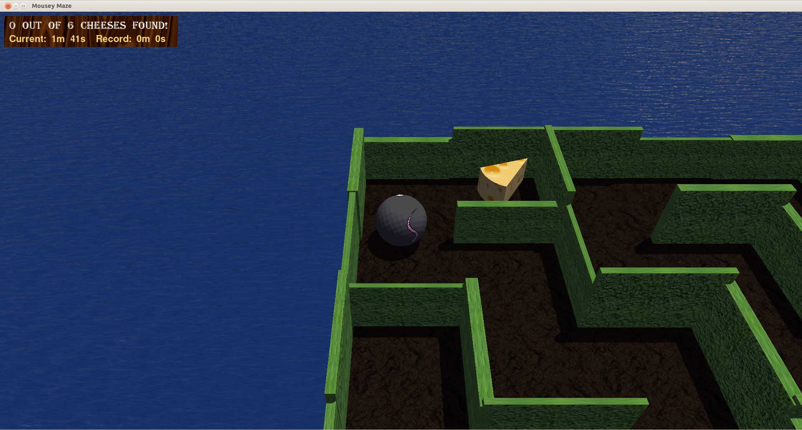
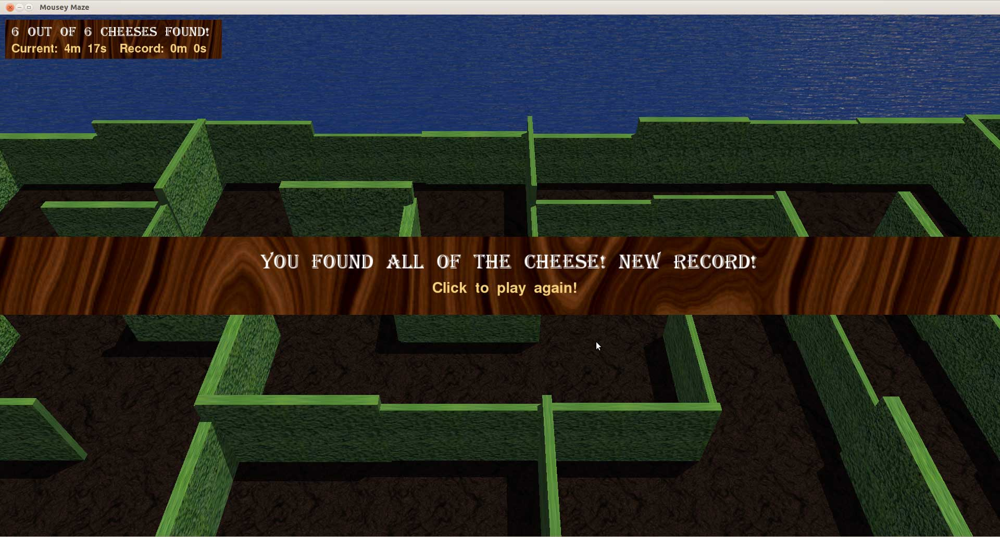
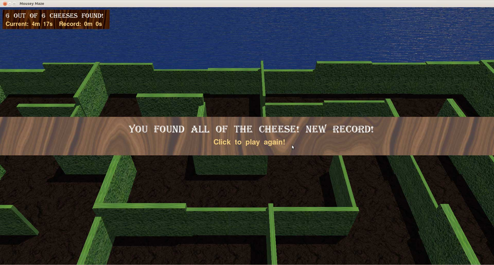
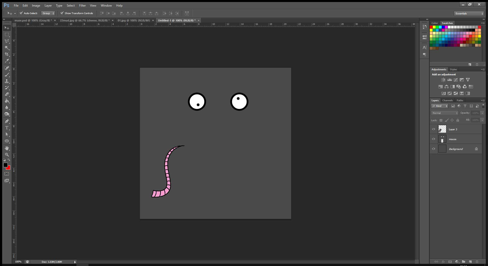
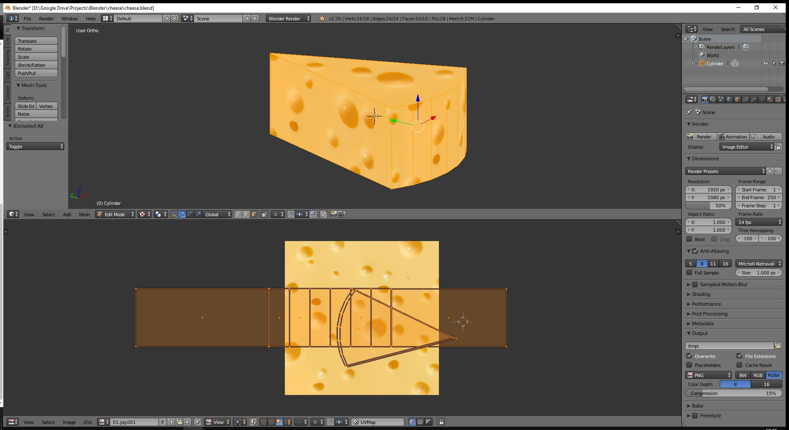

This classical maze game was developed during my university games computing module. It is written in C++ and compiled
under Linux with g++, utilising the Ogre3D graphical library for rendering the scene (with its shipped OIS library for
handling mouse and keyboard input) and ODE for simulating the game physics. The objective of the game will be to
navigate your mouse character around a hedge maze to capture all of the collectable rotating cheese segments in the
shortest time possible, with the ability to replay the same level in order to beat your previous time record. There is a
graphical display of the number of cheese segments collected, the current time elapsed since starting the level and the
previous record time. The game can be downloaded below.

 
 

The mouse was textured in [Blender](https://www.blender.org/) by unwrapping a sphere mesh and UV mapping a minimalistic
mouse texture created in Photoshop to it. The Blender
plug-in [Blender RealXtend Tundra](https://bitbucket.org/iboshkov/blender2ogre) was then used to export the Blender mesh
with UV co-ordinate data and
the [OgreCommandLineTools 1.7.2](https://sourceforge.net/projects/ogre/files/ogre-tools/1.7.2/OgreCommandLineTools_1.7.2.zip)
set of scripts was used convert this into a `.mesh` file to be rendered by the Ogre3D engine. Blender was also used to
model and texture the cheese segment asset. I created an interpreter to parse game level creating instructions from a
text file in order to make creating new levels more efficient without having to recompile the game each time. It ignores
new lines and comment lines prefixed with a hash character; this improves readability by making it easy to group and
label sections of wall creation instructions together. This project encouraged me to learn how to utilise Makefiles in
order more efficiently build C++ programs.

 

- Execute `MazeGame` to launch the game.
- WASD or arrow keys to roll the mouse.
- Escape key to exit the game.
- Built on Ubuntu 14.04. Dependencies: Ogre3D 1.9

TODO: Click to download