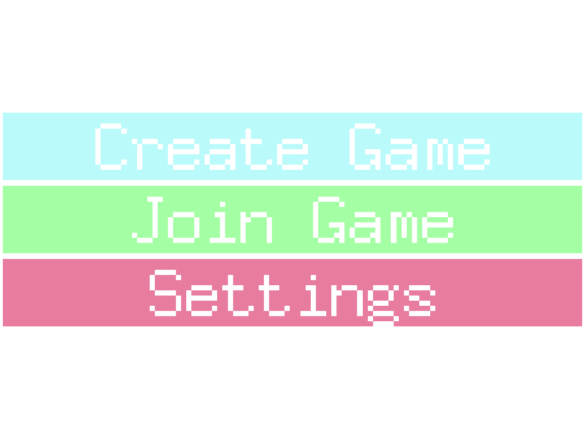
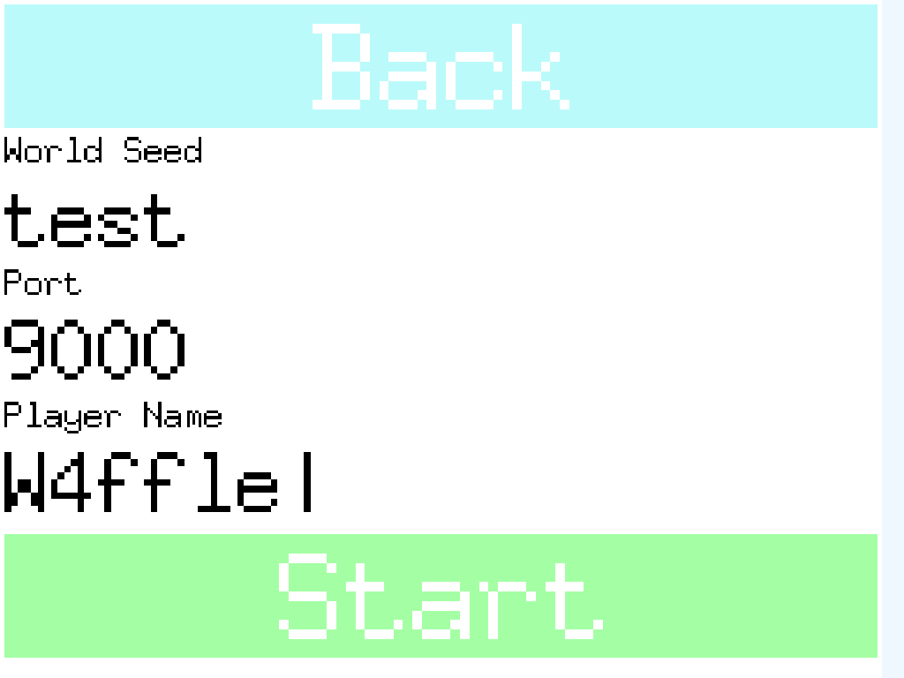
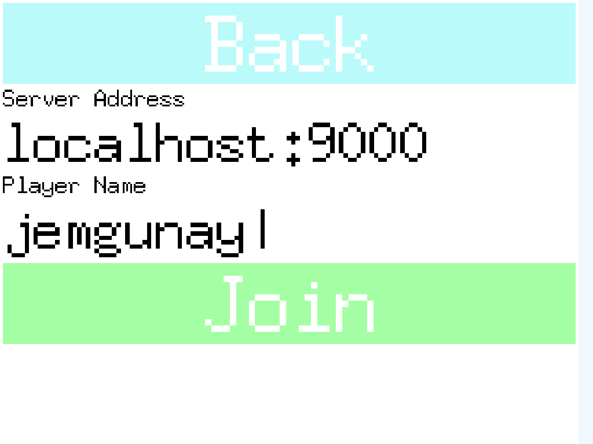
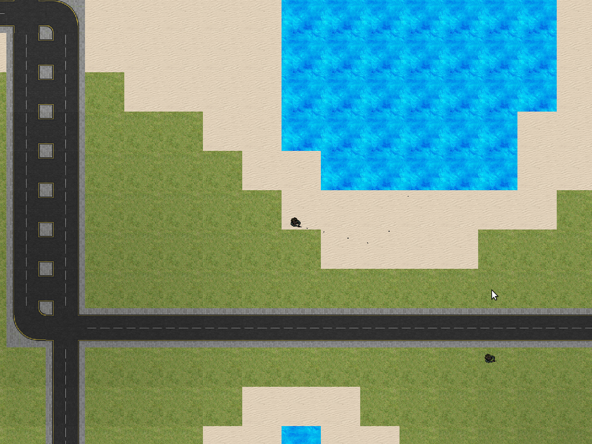
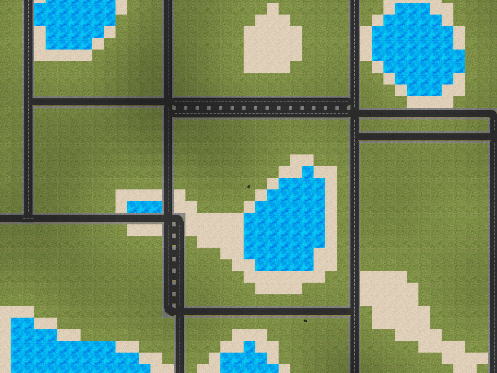
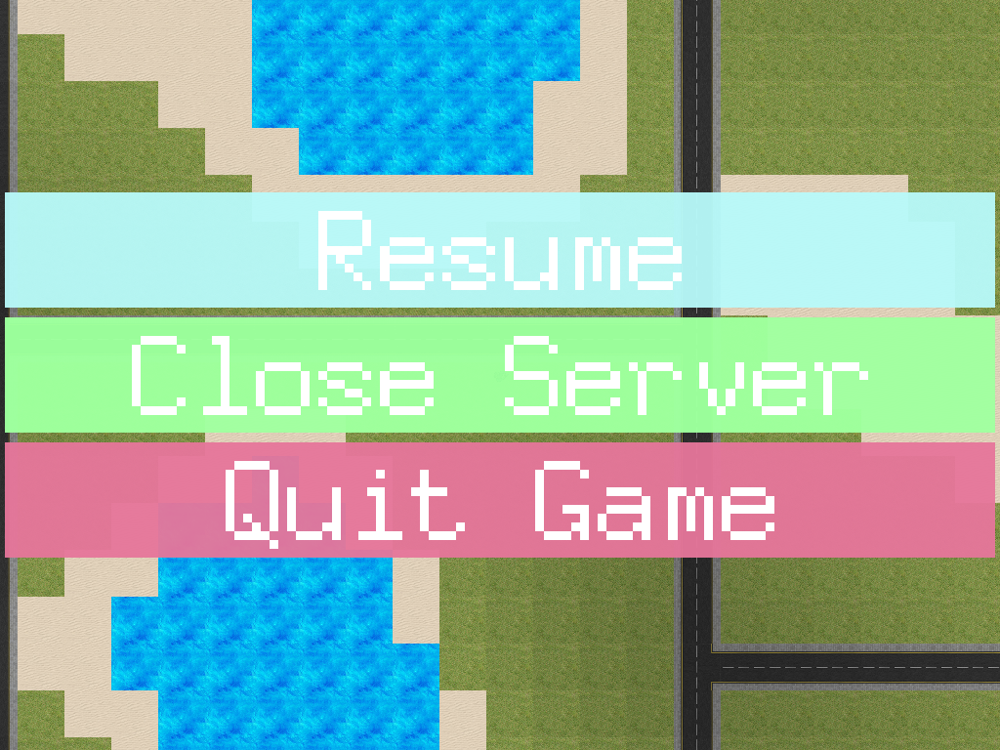

See the GitHub repository [here](https://github.com/jemgunay/procedural-game).

I was keen to apply my Golang experience to the world of game development, of which I'd explored in several other
languages. I came across the Pixel 2D game library and wanted to combine it with the powerful concurrency model and
networking packages that Go provides out of the box. The result was a multiplayer procedural terrain game consisting of:

- A seedable procedural world generator implemented with Perlin noise. Worlds consist of grassy mainland, bodies of
  water, sandy beaches, and a dynamically generated road network.
- Ability to host multiplayer worlds for other players to join over TCP.
- A basic weapons inventory and ammo system, with the ability to shoot other players.
- A flexible and responsive menu system with buttons, text inputs and scroll bars.
- Water wave shaders.

  

  