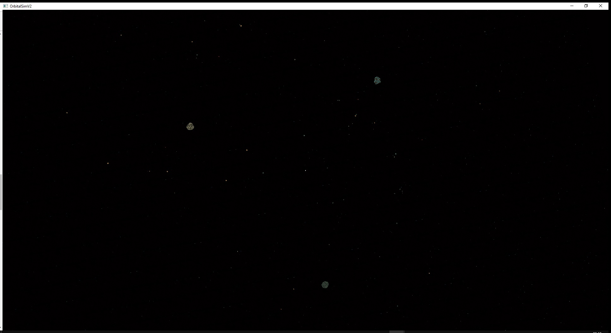
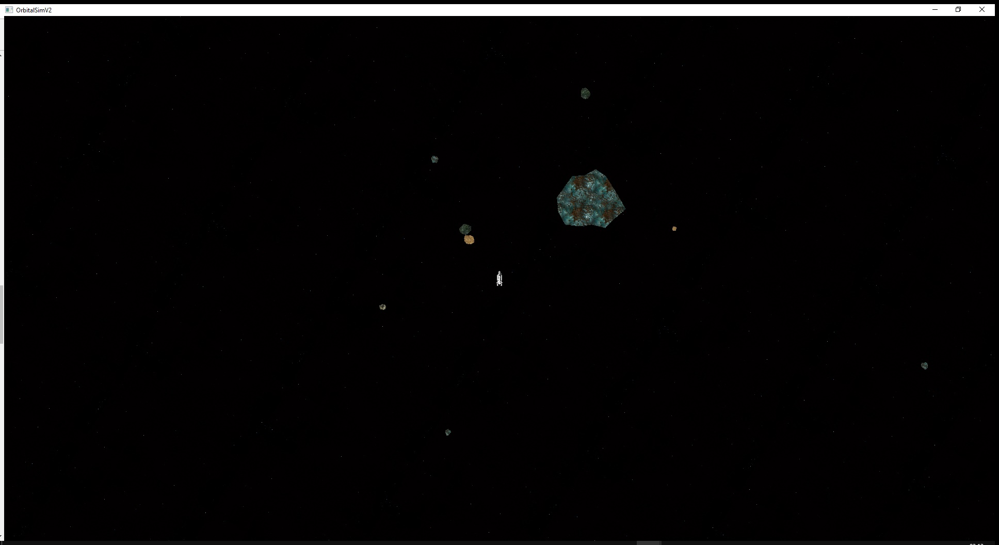
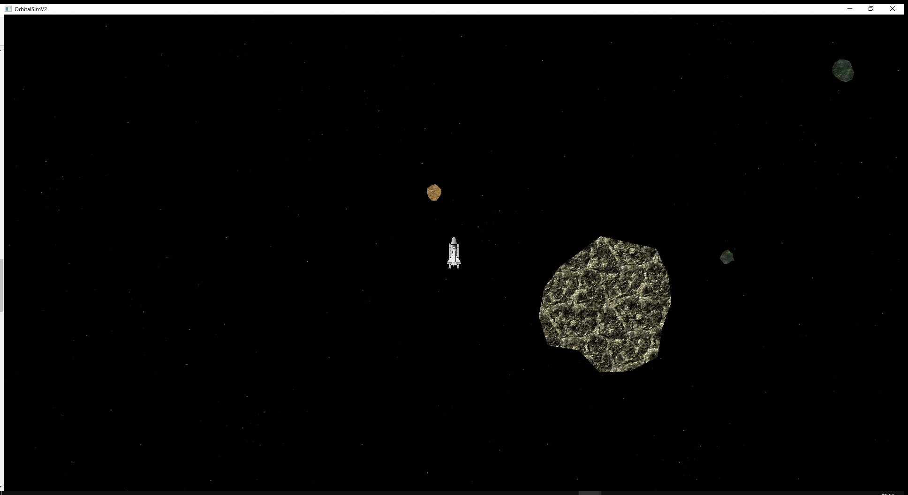
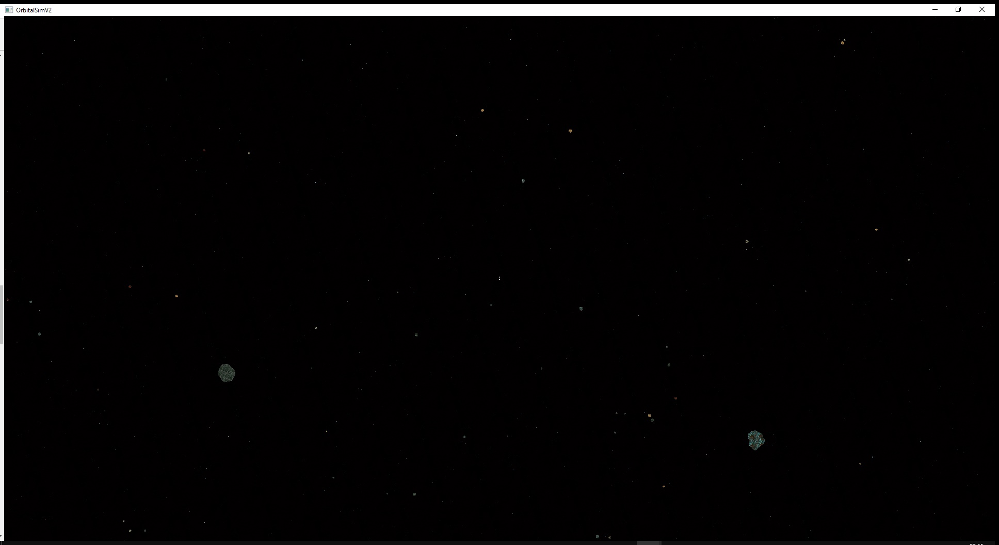
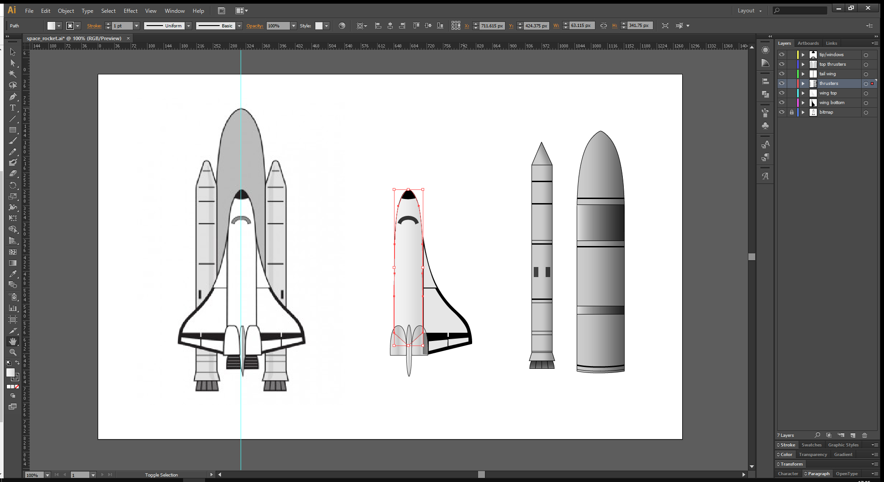

See the GitHub repository [here](https://github.com/jemgunay/orbital-sim).

As a follow-up to [Part 1](/p/orbital-simulation-part-1), I decided to rewrite the orbital planet simulation from scratch, this time scrapping the
physics library and instead implementing my own physics. On launch, three galaxies consisting of around 100 planets each
are spawned which orbit a larger planet sitting at the centre of their galaxy. These planets are all gravitationally
attracted towards each other and deflect on collision.

Each planet has a randomised size, shape and texture; smaller planets are given an initial impulse to push them into an
orbit. The controllable rocket can be used to navigate the cosmos and its physics are also simulated; the rocket vector
graphic was created in Adobe Illustrator.

  

 

The simulation can be seen in action below:

