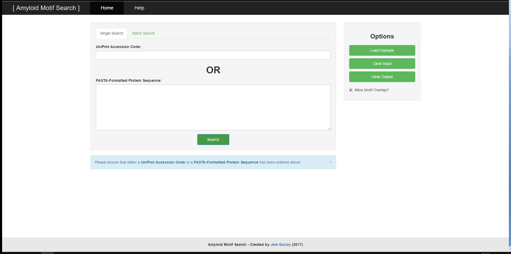
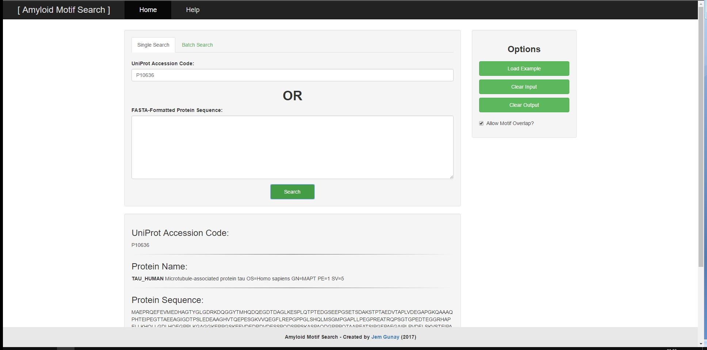
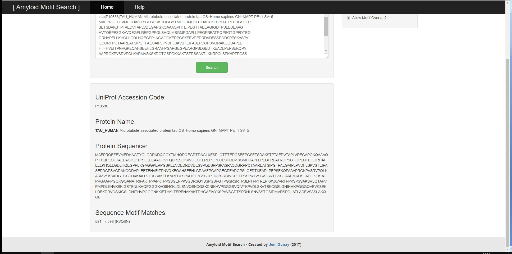
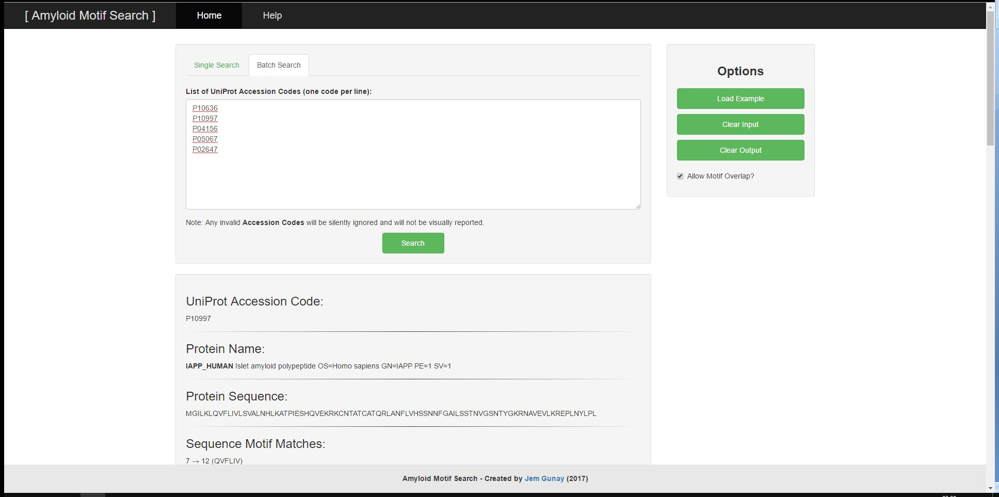
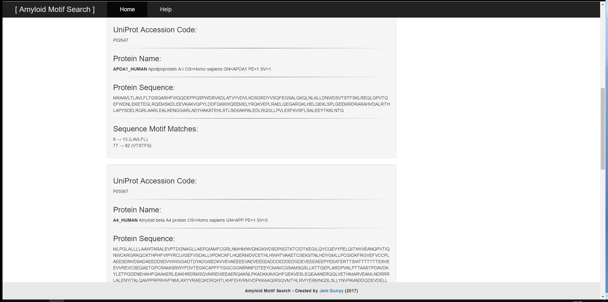

See the GitHub repository [here](https://github.com/jemgunay/amyloid-motif).

I took a Bioinformatics module which explores the development of methods and software tools for understanding biological
data. I was tasked with producing a tool that searches a protein sequence for any matched motifs, providing the position
of each motif found. In particular, the tool had to detect regions of protein sequences which could form amyloid
associations; these have been associated with neurodegenerative diseases such as Alzheimer’s disease and Parkinson’s
disease.

User provided input can consist of either a UniProt Accessor Code or a FASTA-Formatted Protein Sequence and will result
in the output of the UniProt Accessor Code, the FASTA-Formatted Protein Sequence, the Protein Name and the corresponding
Sequence Motif Matches. The tool has two main functions; the ability to search a singular protein sequence for patterns
and the ability to search through a batch of protein sequences by their UniProt Accessor Codes all at once. For both
functions, there are example inputs and options to clear input and output. The search algorithm and input validations
utilise regular expressions to search for relevant motifs and to prevent malformed user input from leading to
undesirable results or performance.

  

The tool was developed using Python 2.7, as well as HTML5, CSS3 and JavaScript. The Bootstrap front-end framework was
used to design the front-end of the system efficiently and the jQuery library was used to write more elegant dynamic
code. It can run offline on local web servers which allow the execution of Python files via CGI (Common Gateway
Interface) assuming sufficient permissions have been set.

 